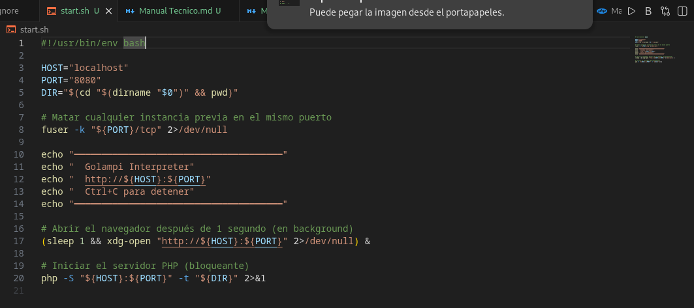
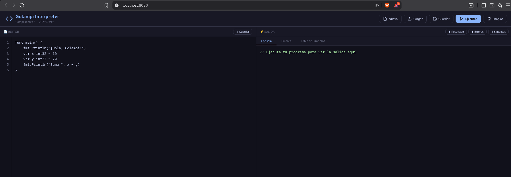
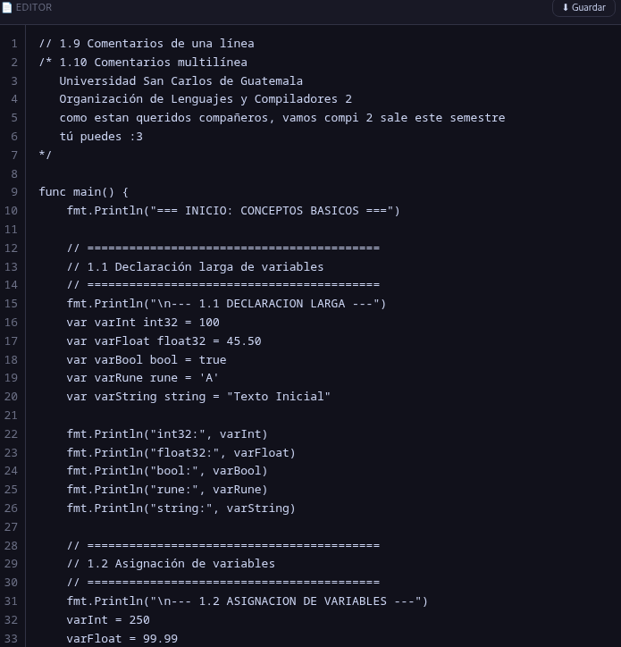
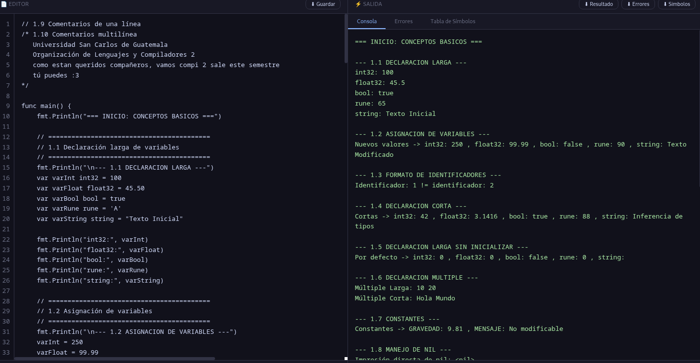
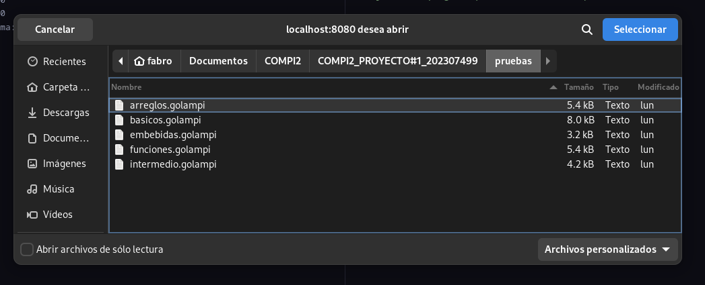
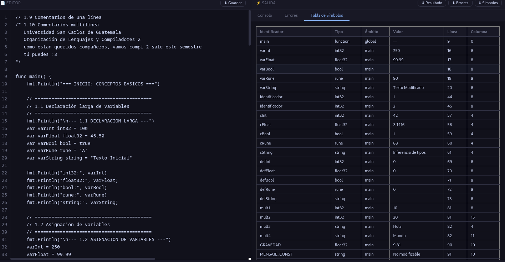
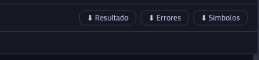
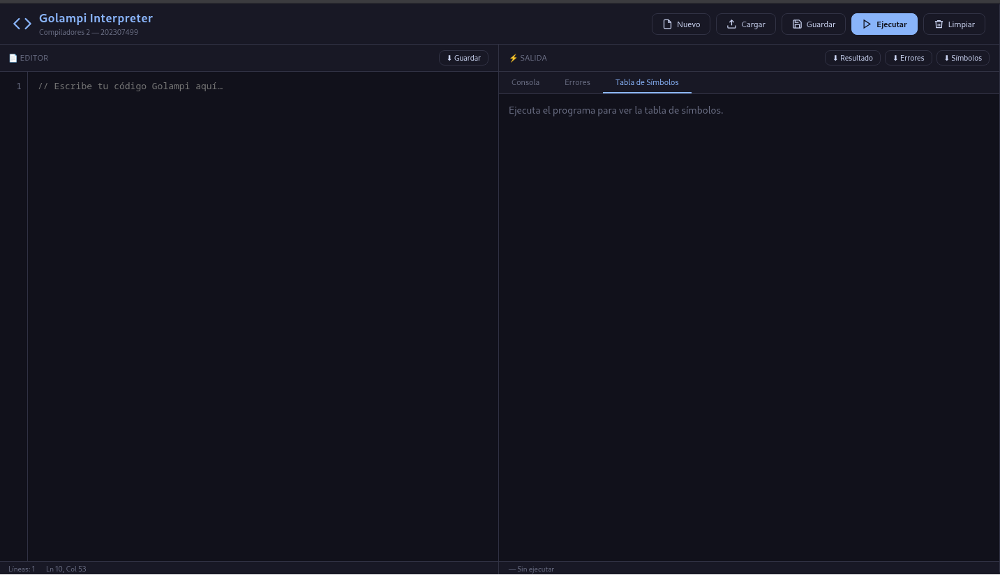

# Manual de Usuario - Interprete Golampi

Nota: las capturas usadas en este manual se encuentran en `Documentacion/img/`.

## 1. Introduccion

Este manual describe como utilizar el interprete Golampi desde la interfaz web.

Con esta herramienta puedes:

- escribir o cargar codigo `.golampi`
- ejecutar programas
- visualizar salida en consola
- revisar errores semanticos y sintacticos
- consultar la tabla de simbolos
- descargar reportes

---

## 2. Requisitos Minimos

- Sistema operativo con PHP 8.x instalado
- Navegador web (Chrome, Firefox, Edge)
- Proyecto con dependencias instaladas (`composer install`)

---

## 3. Como Iniciar la Aplicacion

## Paso 1. Levantar servidor web

Ejecuta:

```bash
./start.sh
```

El script abre automaticamente el navegador en `http://localhost:8080`.

### Imagen 1



## Paso 2. Verificar apertura de la interfaz

Debe mostrarse la pantalla principal con:

- panel izquierdo: editor de codigo
- panel derecho: consola, errores y tabla de simbolos

### Imagen 2



---

## 4. Descripcion de la Interfaz

## 4.1 Barra superior de acciones

Botones disponibles:

- `Nuevo`: crea un archivo en blanco
- `Cargar`: importa codigo desde archivo
- `Guardar`: descarga el contenido del editor
- `Ejecutar`: corre el programa actual
- `Limpiar`: limpia editor y paneles de salida

### Imagen 3


## 4.2 Panel de editor

Funciones del editor:

- escritura de codigo Golampi
- numeracion de lineas
- tabulacion con tecla `Tab`
- atajo `Ctrl + Enter` para ejecutar

### Imagen 4




## 4.3 Panel de resultados

Pestanas disponibles:

- `Consola`: salida del programa
- `Errores`: tabla de errores encontrados
- `Tabla de Simbolos`: variables y funciones registradas

### Imagen 5



---

## 5. Flujo de Uso Recomendado

## Paso 1. Cargar codigo

Haz clic en `Cargar` y selecciona un archivo `.golampi`.

Ejemplos sugeridos:

- `pruebas/basicos.golampi`
- `pruebas/intermedio.golampi`
- `pruebas/funciones.golampi`

### Imagen 6



## Paso 2. Verificar codigo en el editor

Confirma que el contenido aparezca correctamente en el panel izquierdo.

### Imagen 7


## Paso 3. Ejecutar programa

Haz clic en `Ejecutar` o presiona `Ctrl + Enter`.

### Imagen 8


## Paso 4. Revisar salida en consola

Ve a la pestana `Consola` para validar resultados del programa.

### Imagen 9


## Paso 5. Revisar errores (si existen)

Ve a la pestana `Errores` para identificar:

- tipo de error
- descripcion
- linea
- columna

### Imagen 10



## Paso 6. Revisar tabla de simbolos

Abre `Tabla de Simbolos` para verificar:

- identificador
- tipo
- ambito
- valor

### Imagen 11


## Paso 7. Descargar reportes

Usa los botones del panel derecho:

- `Resultado` (salida)
- `Errores`
- `Simbolos`

### Imagen 12



## Paso 8. Limpiar entorno de trabajo

Haz clic en `Limpiar` para:

- vaciar el editor
- limpiar consola
- resetear errores
- resetear tabla de simbolos

### Imagen 13



---

## 6. Cierre de la Aplicacion

Para detener el servidor, vuelve a la terminal donde corriste `./start.sh` y presiona:

```text
Ctrl + C
```

### Imagen 14


